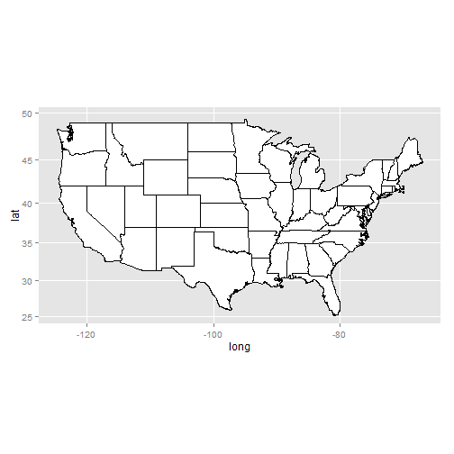

Election Forecasting Revisited
========================================================

In the recitation from Week 3, we used logistic regression on polling data in order to construct US presidential election predictions. We separated our data into a training set, containing data from 2004 and 2008 polls, and a test set, containing the data from 2012 polls. We then proceeded to develop a logistic regression model to forecast the 2012 US presidential election.

In this homework problem, we'll revisit our logistic regression model from Week 3, and learn how to plot the output on a map of the United States. Unlike what we did in the Crime lecture, this time we'll be plotting predictions rather than data!

First, load the ggplot2, maps, and ggmap packages using the library function. All three packages should be installed on your computer from lecture, but if not, you may need to install them too using the install.packages function.


```r
library(ggplot2)
library(maps)
library(ggmap)
```

Then, load the US map and save it to the variable statesMap:


```r
statesMap = map_data("state")
str(statesMap)
```

```
## 'data.frame':	15537 obs. of  6 variables:
##  $ long     : num  -87.5 -87.5 -87.5 -87.5 -87.6 ...
##  $ lat      : num  30.4 30.4 30.4 30.3 30.3 ...
##  $ group    : num  1 1 1 1 1 1 1 1 1 1 ...
##  $ order    : int  1 2 3 4 5 6 7 8 9 10 ...
##  $ region   : chr  "alabama" "alabama" "alabama" "alabama" ...
##  $ subregion: chr  NA NA NA NA ...
```


The maps package contains other built-in maps, including a US county map, a world map, a basic new zealand map, usa, Pacific Centric Low resolution World Map and maps for France and Italy.

## Problem 1.1 - Drawing a Map of the US

**Q:** If you look at the structure of the statesMap data frame using the str function, you should see that there are 6 variables. One of the variables, group, defines the different shapes or polygons on the map. Sometimes a state may have multiple groups, for example, if it includes islands. How many different groups are there? 


```r
table(statesMap$group)
```

```
## 
##    1    2    3    4    5    6    7    8    9   10   11   12   13   14   15 
##  202  149  312  516   79   91   94   10  872  381  233  329  257  256  113 
##   16   17   18   19   20   21   22   23   24   25   26   27   28   29   30 
##  397  650  399  566   36  220   30  460  370  373  382  315  238  208   70 
##   31   32   33   34   35   36   37   38   39   40   41   42   43   44   45 
##  125  205   78   16  290   21  168   37  733   12  105  238  284  236  172 
##   46   47   48   49   50   51   52   53   54   55   56   57   58   59   60 
##   66  304  166  289 1088   59  129   96   15  623   17   17   19   44  448 
##   61   62   63 
##  373  388   68
```

```r
length(table(statesMap$group))
```

```
## [1] 63
```


**ANS: ** 63

The variable "order" defines the order to connect the points within each group, and the variable "region" gives the name of the state. 

## Problem 1.2 - Drawing a Map of the US

You can draw a map of the United States by typing the following in your R console:


```r
ggplot(statesMap, aes(x = long, y = lat, group = group)) + geom_polygon(fill = "white", 
    color = "black") + coord_map("mercator")
```

 


As we saw in lecture, we used the option coord_map. This sets the type of map projection. The option "mercator" just creates a flat projection. Other options include "orthographic" and "polyconic". To see all options, type ?mapproject in your R console.

We specified two colors in geom_polygon -- fill and color. 
**Q:** Which one defined the color of the outline of the states?

**ANS:** Color

**Explanation**

In our plot, the states are outlined in black, which is the color we specified for the option "color". To confirm that this is changing the outline color of the states, you can try re-running the command with a different color:

*ggplot(statesMap, aes(x = long, y = lat, group = group)) + geom_polygon(fill = "white", color = "pink") + coord_map("mercator")*

## Problem 2.1 - Coloring the States by Predictions

Now, let's color the map of the US according to our 2012 US presidential election predictions from the Week 3 Recitation. We'll rebuild the model here, using the dataset PollingImputed.csv. Be sure to use this file so that you don't have to redo the imputation to fill in the missing values, like we did in the Week 3 Recitation.

Load the data using the read.csv function, and call it "polling". Then split the data using the subset function into a training set called "Train" that has observations from 2004 and 2008, and a testing set called "Test" that has observations from 2012.

Note that we only have 45 states in our testing set, since we are missing observations for Alaska, Delaware, Alabama, Wyoming, and Vermont, so these states will not appear colored in our map. 


```r

polling = read.csv("PollingImputed.csv")
```

```
## Warning: cannot open file 'PollingImputed.csv': No such file or directory
```

```
## Error: cannot open the connection
```

```r
str(polling)
```

```
## Error: object 'polling' not found
```

```r
Train = subset(polling, polling$Year <= 2008)
```

```
## Error: object 'polling' not found
```

```r
Test = subset(polling, polling$Year >= 2012)
```

```
## Error: object 'polling' not found
```


Then, create a logistic regression model and make predictions on the test set using the following commands:


```r
mod2 = glm(Republican ~ SurveyUSA + DiffCount, data = Train, family = "binomial")
```

```
## Error: object 'Train' not found
```

```r
print(mod2)
```

```
## Error: object 'mod2' not found
```

```r
summary(mod2)
```

```
## Error: object 'mod2' not found
```

```r
TestPrediction = predict(mod2, newdata = Test, type = "response")
```

```
## Error: object 'mod2' not found
```


TestPrediction gives the predicted probabilities for each state, but let's also create a vector of Republican/Democrat predictions by using the following command:


```r
TestPredictionBinary = as.numeric(TestPrediction > 0.5)
```

```
## Error: object 'TestPrediction' not found
```


Now, put the predictions and state labels in a data.frame so that we can use ggplot:


```r
PredictionDataFrame = data.frame(TestPrediction, TestPredictionBinary, Test$State)
```

```
## Error: object 'TestPrediction' not found
```

```r
str(PredictionDataFrame)
```

```
## Error: object 'PredictionDataFrame' not found
```

```r
table(TestPredictionBinary)
```

```
## Error: object 'TestPredictionBinary' not found
```

```r
summary(TestPrediction)
```

```
## Error: object 'TestPrediction' not found
```


To make sure everything went smoothly, answer the following questions.

For how many states is our binary prediction 1, corresponding to Republican?

**ANS:** 22

What is the average predicted probability of our model?


**ANS:** 0.4853000

# Problem 2.2 - Coloring the States by Predictions

Now, we need to merge "predictionDataFrame" with the map data "statesMap", Before doing so, we need to convert the Test.State variable to lowercase, so that it matches the region variable in statesMap. So we will create a new variable called "region" in the PredictionDataFrame to have lowercase State names. Do this by typing the following in your R console:


```r

PredictionDataFrame$region = tolower(PredictionDataFrame$Test.State)
```

```
## Error: object 'PredictionDataFrame' not found
```

```r
str(PredictionDataFrame)
```

```
## Error: object 'PredictionDataFrame' not found
```


Now, merge the two data frames using the following command:


```r

PredictionMap = merge(statesMap, PredictionDataFrame, by = "region")
```

```
## Error: object 'PredictionDataFrame' not found
```


Lastly, we need to make sure the observations are in order (by the order variable), so that the map is drawn properly, by typing the following:


```r

PredictionMap = PredictionMap[order(PredictionMap$order), ]
```

```
## Error: object 'PredictionMap' not found
```

```r
str(PredictionMap)
```

```
## Error: object 'PredictionMap' not found
```

```r
str(statesMap)
```

```
## 'data.frame':	15537 obs. of  6 variables:
##  $ long     : num  -87.5 -87.5 -87.5 -87.5 -87.6 ...
##  $ lat      : num  30.4 30.4 30.4 30.3 30.3 ...
##  $ group    : num  1 1 1 1 1 1 1 1 1 1 ...
##  $ order    : int  1 2 3 4 5 6 7 8 9 10 ...
##  $ region   : chr  "alabama" "alabama" "alabama" "alabama" ...
##  $ subregion: chr  NA NA NA NA ...
```

```r
merge
```

```
## function (x, y, ...) 
## UseMethod("merge")
## <bytecode: 0x000000000756afd8>
## <environment: namespace:base>
```

**Q:** How many observations are there in predictionMap?

**ANS:** 15034

**Q:** How many observations are there in statesMap?

**ANS:** 15537

##  Problem 2.3 - Coloring the States by Predictions

**Q:** When we merged the data in the previous problem, it caused the number of observations to change. Why? Check out the help page for merge by typing ?merge to help you answer this question.

**ANS:** Because we only make predictions for 45 states, we no longer have observations for some of the states. These observations were removed in the merging process. 

**Explanation**

When we merge data, it only merged the observations that exist in both data sets. So since we are merging based on the region variable, we will lose all observations that have a value of "region" that doesn't exist in both data frames. You can change this default behavior by using the all.x and all.y arguments of the merge function. For more information, look at the help page for the merge function by typing ?merge in your R console.

## Problem 2.4 - Coloring the States by Predictions

Now we are ready to color the US map with our predictions! You can color the states according to our binary predictions by typing the following in your R console:


```r

ggplot(PredictionMap, aes(x = long, y = lat, group = group, fill = TestPredictionBinary)) + 
    geom_polygon(color = "black")
```

```
## Error: object 'PredictionMap' not found
```


**Q:** The states appear light blue and dark blue in this map. Which color represents a Republican prediction?

**ANS:** Light Blue

## Problem 2.5 - Coloring the States by Predictions

We see that the legend displays a blue gradient for outcomes between 0 and 1. However, in our model there are only two possible outcomes: 0 or 1. Let's replot the map with discrete outcomes. We can also change the color scheme to blue and red, to match the blue color associated with the Democratic Party in the US and the red color associated with the Republican Party in the US. This can be done with the following command:


```r

ggplot(PredictionMap, aes(x = long, y = lat, group = group, fill = TestPredictionBinary)) + 
    geom_polygon(color = "black") + scale_fill_gradient(low = "blue", high = "red", 
    guide = "legend", breaks = c(0, 1), labels = c("Democrate", "Republican"), 
    name = "Prediction 2012")
```

```
## Error: object 'PredictionMap' not found
```


Alternatively, we could plot the probabilities instead of the binary predictions. Change the plot command above to instead color the states by the variable TestPrediction. 


```r

ggplot(PredictionMap, aes(x = long, y = lat, group = group, fill = TestPrediction)) + 
    geom_polygon(color = "black") + scale_fill_gradient(low = "blue", high = "red", 
    guide = "legend", name = "Prediction 2012")
```

```
## Error: object 'PredictionMap' not found
```


**Q:** How many states look purple in the map?

**ANS:** 1

##  Problem 3.1 - Understanding the Predictions 
