Week - 8 Visualisation - Basic Scatterplots Using ggplot
========================================================

# Colors and shapes in R

If you want to see all of the available colors in R, type in your R console:


```r
colors()
```

```
##   [1] "white"                "aliceblue"            "antiquewhite"        
##   [4] "antiquewhite1"        "antiquewhite2"        "antiquewhite3"       
##   [7] "antiquewhite4"        "aquamarine"           "aquamarine1"         
##  [10] "aquamarine2"          "aquamarine3"          "aquamarine4"         
##  [13] "azure"                "azure1"               "azure2"              
##  [16] "azure3"               "azure4"               "beige"               
##  [19] "bisque"               "bisque1"              "bisque2"             
##  [22] "bisque3"              "bisque4"              "black"               
##  [25] "blanchedalmond"       "blue"                 "blue1"               
##  [28] "blue2"                "blue3"                "blue4"               
##  [31] "blueviolet"           "brown"                "brown1"              
##  [34] "brown2"               "brown3"               "brown4"              
##  [37] "burlywood"            "burlywood1"           "burlywood2"          
##  [40] "burlywood3"           "burlywood4"           "cadetblue"           
##  [43] "cadetblue1"           "cadetblue2"           "cadetblue3"          
##  [46] "cadetblue4"           "chartreuse"           "chartreuse1"         
##  [49] "chartreuse2"          "chartreuse3"          "chartreuse4"         
##  [52] "chocolate"            "chocolate1"           "chocolate2"          
##  [55] "chocolate3"           "chocolate4"           "coral"               
##  [58] "coral1"               "coral2"               "coral3"              
##  [61] "coral4"               "cornflowerblue"       "cornsilk"            
##  [64] "cornsilk1"            "cornsilk2"            "cornsilk3"           
##  [67] "cornsilk4"            "cyan"                 "cyan1"               
##  [70] "cyan2"                "cyan3"                "cyan4"               
##  [73] "darkblue"             "darkcyan"             "darkgoldenrod"       
##  [76] "darkgoldenrod1"       "darkgoldenrod2"       "darkgoldenrod3"      
##  [79] "darkgoldenrod4"       "darkgray"             "darkgreen"           
##  [82] "darkgrey"             "darkkhaki"            "darkmagenta"         
##  [85] "darkolivegreen"       "darkolivegreen1"      "darkolivegreen2"     
##  [88] "darkolivegreen3"      "darkolivegreen4"      "darkorange"          
##  [91] "darkorange1"          "darkorange2"          "darkorange3"         
##  [94] "darkorange4"          "darkorchid"           "darkorchid1"         
##  [97] "darkorchid2"          "darkorchid3"          "darkorchid4"         
## [100] "darkred"              "darksalmon"           "darkseagreen"        
## [103] "darkseagreen1"        "darkseagreen2"        "darkseagreen3"       
## [106] "darkseagreen4"        "darkslateblue"        "darkslategray"       
## [109] "darkslategray1"       "darkslategray2"       "darkslategray3"      
## [112] "darkslategray4"       "darkslategrey"        "darkturquoise"       
## [115] "darkviolet"           "deeppink"             "deeppink1"           
## [118] "deeppink2"            "deeppink3"            "deeppink4"           
## [121] "deepskyblue"          "deepskyblue1"         "deepskyblue2"        
## [124] "deepskyblue3"         "deepskyblue4"         "dimgray"             
## [127] "dimgrey"              "dodgerblue"           "dodgerblue1"         
## [130] "dodgerblue2"          "dodgerblue3"          "dodgerblue4"         
## [133] "firebrick"            "firebrick1"           "firebrick2"          
## [136] "firebrick3"           "firebrick4"           "floralwhite"         
## [139] "forestgreen"          "gainsboro"            "ghostwhite"          
## [142] "gold"                 "gold1"                "gold2"               
## [145] "gold3"                "gold4"                "goldenrod"           
## [148] "goldenrod1"           "goldenrod2"           "goldenrod3"          
## [151] "goldenrod4"           "gray"                 "gray0"               
## [154] "gray1"                "gray2"                "gray3"               
## [157] "gray4"                "gray5"                "gray6"               
## [160] "gray7"                "gray8"                "gray9"               
## [163] "gray10"               "gray11"               "gray12"              
## [166] "gray13"               "gray14"               "gray15"              
## [169] "gray16"               "gray17"               "gray18"              
## [172] "gray19"               "gray20"               "gray21"              
## [175] "gray22"               "gray23"               "gray24"              
## [178] "gray25"               "gray26"               "gray27"              
## [181] "gray28"               "gray29"               "gray30"              
## [184] "gray31"               "gray32"               "gray33"              
## [187] "gray34"               "gray35"               "gray36"              
## [190] "gray37"               "gray38"               "gray39"              
## [193] "gray40"               "gray41"               "gray42"              
## [196] "gray43"               "gray44"               "gray45"              
## [199] "gray46"               "gray47"               "gray48"              
## [202] "gray49"               "gray50"               "gray51"              
## [205] "gray52"               "gray53"               "gray54"              
## [208] "gray55"               "gray56"               "gray57"              
## [211] "gray58"               "gray59"               "gray60"              
## [214] "gray61"               "gray62"               "gray63"              
## [217] "gray64"               "gray65"               "gray66"              
## [220] "gray67"               "gray68"               "gray69"              
## [223] "gray70"               "gray71"               "gray72"              
## [226] "gray73"               "gray74"               "gray75"              
## [229] "gray76"               "gray77"               "gray78"              
## [232] "gray79"               "gray80"               "gray81"              
## [235] "gray82"               "gray83"               "gray84"              
## [238] "gray85"               "gray86"               "gray87"              
## [241] "gray88"               "gray89"               "gray90"              
## [244] "gray91"               "gray92"               "gray93"              
## [247] "gray94"               "gray95"               "gray96"              
## [250] "gray97"               "gray98"               "gray99"              
## [253] "gray100"              "green"                "green1"              
## [256] "green2"               "green3"               "green4"              
## [259] "greenyellow"          "grey"                 "grey0"               
## [262] "grey1"                "grey2"                "grey3"               
## [265] "grey4"                "grey5"                "grey6"               
## [268] "grey7"                "grey8"                "grey9"               
## [271] "grey10"               "grey11"               "grey12"              
## [274] "grey13"               "grey14"               "grey15"              
## [277] "grey16"               "grey17"               "grey18"              
## [280] "grey19"               "grey20"               "grey21"              
## [283] "grey22"               "grey23"               "grey24"              
## [286] "grey25"               "grey26"               "grey27"              
## [289] "grey28"               "grey29"               "grey30"              
## [292] "grey31"               "grey32"               "grey33"              
## [295] "grey34"               "grey35"               "grey36"              
## [298] "grey37"               "grey38"               "grey39"              
## [301] "grey40"               "grey41"               "grey42"              
## [304] "grey43"               "grey44"               "grey45"              
## [307] "grey46"               "grey47"               "grey48"              
## [310] "grey49"               "grey50"               "grey51"              
## [313] "grey52"               "grey53"               "grey54"              
## [316] "grey55"               "grey56"               "grey57"              
## [319] "grey58"               "grey59"               "grey60"              
## [322] "grey61"               "grey62"               "grey63"              
## [325] "grey64"               "grey65"               "grey66"              
## [328] "grey67"               "grey68"               "grey69"              
## [331] "grey70"               "grey71"               "grey72"              
## [334] "grey73"               "grey74"               "grey75"              
## [337] "grey76"               "grey77"               "grey78"              
## [340] "grey79"               "grey80"               "grey81"              
## [343] "grey82"               "grey83"               "grey84"              
## [346] "grey85"               "grey86"               "grey87"              
## [349] "grey88"               "grey89"               "grey90"              
## [352] "grey91"               "grey92"               "grey93"              
## [355] "grey94"               "grey95"               "grey96"              
## [358] "grey97"               "grey98"               "grey99"              
## [361] "grey100"              "honeydew"             "honeydew1"           
## [364] "honeydew2"            "honeydew3"            "honeydew4"           
## [367] "hotpink"              "hotpink1"             "hotpink2"            
## [370] "hotpink3"             "hotpink4"             "indianred"           
## [373] "indianred1"           "indianred2"           "indianred3"          
## [376] "indianred4"           "ivory"                "ivory1"              
## [379] "ivory2"               "ivory3"               "ivory4"              
## [382] "khaki"                "khaki1"               "khaki2"              
## [385] "khaki3"               "khaki4"               "lavender"            
## [388] "lavenderblush"        "lavenderblush1"       "lavenderblush2"      
## [391] "lavenderblush3"       "lavenderblush4"       "lawngreen"           
## [394] "lemonchiffon"         "lemonchiffon1"        "lemonchiffon2"       
## [397] "lemonchiffon3"        "lemonchiffon4"        "lightblue"           
## [400] "lightblue1"           "lightblue2"           "lightblue3"          
## [403] "lightblue4"           "lightcoral"           "lightcyan"           
## [406] "lightcyan1"           "lightcyan2"           "lightcyan3"          
## [409] "lightcyan4"           "lightgoldenrod"       "lightgoldenrod1"     
## [412] "lightgoldenrod2"      "lightgoldenrod3"      "lightgoldenrod4"     
## [415] "lightgoldenrodyellow" "lightgray"            "lightgreen"          
## [418] "lightgrey"            "lightpink"            "lightpink1"          
## [421] "lightpink2"           "lightpink3"           "lightpink4"          
## [424] "lightsalmon"          "lightsalmon1"         "lightsalmon2"        
## [427] "lightsalmon3"         "lightsalmon4"         "lightseagreen"       
## [430] "lightskyblue"         "lightskyblue1"        "lightskyblue2"       
## [433] "lightskyblue3"        "lightskyblue4"        "lightslateblue"      
## [436] "lightslategray"       "lightslategrey"       "lightsteelblue"      
## [439] "lightsteelblue1"      "lightsteelblue2"      "lightsteelblue3"     
## [442] "lightsteelblue4"      "lightyellow"          "lightyellow1"        
## [445] "lightyellow2"         "lightyellow3"         "lightyellow4"        
## [448] "limegreen"            "linen"                "magenta"             
## [451] "magenta1"             "magenta2"             "magenta3"            
## [454] "magenta4"             "maroon"               "maroon1"             
## [457] "maroon2"              "maroon3"              "maroon4"             
## [460] "mediumaquamarine"     "mediumblue"           "mediumorchid"        
## [463] "mediumorchid1"        "mediumorchid2"        "mediumorchid3"       
## [466] "mediumorchid4"        "mediumpurple"         "mediumpurple1"       
## [469] "mediumpurple2"        "mediumpurple3"        "mediumpurple4"       
## [472] "mediumseagreen"       "mediumslateblue"      "mediumspringgreen"   
## [475] "mediumturquoise"      "mediumvioletred"      "midnightblue"        
## [478] "mintcream"            "mistyrose"            "mistyrose1"          
## [481] "mistyrose2"           "mistyrose3"           "mistyrose4"          
## [484] "moccasin"             "navajowhite"          "navajowhite1"        
## [487] "navajowhite2"         "navajowhite3"         "navajowhite4"        
## [490] "navy"                 "navyblue"             "oldlace"             
## [493] "olivedrab"            "olivedrab1"           "olivedrab2"          
## [496] "olivedrab3"           "olivedrab4"           "orange"              
## [499] "orange1"              "orange2"              "orange3"             
## [502] "orange4"              "orangered"            "orangered1"          
## [505] "orangered2"           "orangered3"           "orangered4"          
## [508] "orchid"               "orchid1"              "orchid2"             
## [511] "orchid3"              "orchid4"              "palegoldenrod"       
## [514] "palegreen"            "palegreen1"           "palegreen2"          
## [517] "palegreen3"           "palegreen4"           "paleturquoise"       
## [520] "paleturquoise1"       "paleturquoise2"       "paleturquoise3"      
## [523] "paleturquoise4"       "palevioletred"        "palevioletred1"      
## [526] "palevioletred2"       "palevioletred3"       "palevioletred4"      
## [529] "papayawhip"           "peachpuff"            "peachpuff1"          
## [532] "peachpuff2"           "peachpuff3"           "peachpuff4"          
## [535] "peru"                 "pink"                 "pink1"               
## [538] "pink2"                "pink3"                "pink4"               
## [541] "plum"                 "plum1"                "plum2"               
## [544] "plum3"                "plum4"                "powderblue"          
## [547] "purple"               "purple1"              "purple2"             
## [550] "purple3"              "purple4"              "red"                 
## [553] "red1"                 "red2"                 "red3"                
## [556] "red4"                 "rosybrown"            "rosybrown1"          
## [559] "rosybrown2"           "rosybrown3"           "rosybrown4"          
## [562] "royalblue"            "royalblue1"           "royalblue2"          
## [565] "royalblue3"           "royalblue4"           "saddlebrown"         
## [568] "salmon"               "salmon1"              "salmon2"             
## [571] "salmon3"              "salmon4"              "sandybrown"          
## [574] "seagreen"             "seagreen1"            "seagreen2"           
## [577] "seagreen3"            "seagreen4"            "seashell"            
## [580] "seashell1"            "seashell2"            "seashell3"           
## [583] "seashell4"            "sienna"               "sienna1"             
## [586] "sienna2"              "sienna3"              "sienna4"             
## [589] "skyblue"              "skyblue1"             "skyblue2"            
## [592] "skyblue3"             "skyblue4"             "slateblue"           
## [595] "slateblue1"           "slateblue2"           "slateblue3"          
## [598] "slateblue4"           "slategray"            "slategray1"          
## [601] "slategray2"           "slategray3"           "slategray4"          
## [604] "slategrey"            "snow"                 "snow1"               
## [607] "snow2"                "snow3"                "snow4"               
## [610] "springgreen"          "springgreen1"         "springgreen2"        
## [613] "springgreen3"         "springgreen4"         "steelblue"           
## [616] "steelblue1"           "steelblue2"           "steelblue3"          
## [619] "steelblue4"           "tan"                  "tan1"                
## [622] "tan2"                 "tan3"                 "tan4"                
## [625] "thistle"              "thistle1"             "thistle2"            
## [628] "thistle3"             "thistle4"             "tomato"              
## [631] "tomato1"              "tomato2"              "tomato3"             
## [634] "tomato4"              "turquoise"            "turquoise1"          
## [637] "turquoise2"           "turquoise3"           "turquoise4"          
## [640] "violet"               "violetred"            "violetred1"          
## [643] "violetred2"           "violetred3"           "violetred4"          
## [646] "wheat"                "wheat1"               "wheat2"              
## [649] "wheat3"               "wheat4"               "whitesmoke"          
## [652] "yellow"               "yellow1"              "yellow2"             
## [655] "yellow3"              "yellow4"              "yellowgreen"
```


Or see the http://www.cookbook-r.com/Graphs/Shapes_and_line_types/

## Grammer of ggplot graphics 

All ggplot graphics consist of three elements.

- **Data**: The first is data, in a data frame.
- **Aesthetic Mapping**: The second is an aesthetic mapping, which describes how variables in the data frame are mapped to graphical attributes. This is where we'll define which variables are on the x-axis and y-axes, whether or not points should be colored or shaped by certain attributes, etc.
- **Geometric objects**: The third element is which geometric objects we want to determine how the data values are rendered graphically. This is where we indicate if the plot should have points, lines,bars, boxes, etc.

we'll be using the data file WHO.csv. Please download this file to your computer, and save it to a location that you will remember. This data comes from the Global Health Observatory Data Repository. 

Let's start by reading in our data. We'll be using the same data set we used during week one, WHO.csv.


```r
WHO = read.csv("C:/Users/Fahad/Documents/R Projects/Data/WHO.csv")
```


Look at the Structure of the dataset:


```r
str(WHO)
```

```
## 'data.frame':	194 obs. of  13 variables:
##  $ Country                      : Factor w/ 194 levels "Afghanistan",..: 1 2 3 4 5 6 7 8 9 10 ...
##  $ Region                       : Factor w/ 6 levels "Africa","Americas",..: 3 4 1 4 1 2 2 4 6 4 ...
##  $ Population                   : int  29825 3162 38482 78 20821 89 41087 2969 23050 8464 ...
##  $ Under15                      : num  47.4 21.3 27.4 15.2 47.6 ...
##  $ Over60                       : num  3.82 14.93 7.17 22.86 3.84 ...
##  $ FertilityRate                : num  5.4 1.75 2.83 NA 6.1 2.12 2.2 1.74 1.89 1.44 ...
##  $ LifeExpectancy               : int  60 74 73 82 51 75 76 71 82 81 ...
##  $ ChildMortality               : num  98.5 16.7 20 3.2 163.5 ...
##  $ CellularSubscribers          : num  54.3 96.4 99 75.5 48.4 ...
##  $ LiteracyRate                 : num  NA NA NA NA 70.1 99 97.8 99.6 NA NA ...
##  $ GNI                          : num  1140 8820 8310 NA 5230 ...
##  $ PrimarySchoolEnrollmentMale  : num  NA NA 98.2 78.4 93.1 91.1 NA NA 96.9 NA ...
##  $ PrimarySchoolEnrollmentFemale: num  NA NA 96.4 79.4 78.2 84.5 NA NA 97.5 NA ...
```


We can see that we have 194 observations, or countries, and 13 different variables-- 

- **Country**: The name of the country
- **Region**: The region the country's in
- **Population**: The population in thousands
- **Under15**: The percentage of the population under 15 
- **Over60**: The percentage of the population over 60
- **FertilityRate**: The fertility rate or average number of children per woman
- **LifeExpectancy**: The life expectancy in years
- **ChildMortality**: The child mortality rate which is the number of children who die by age five per 1,000 births.
- **CellularSubscribers**: The number of cellular subscribers per 100 population
- **LiteracyRate**:  The literacy rate among adults older than 15
- **GNI**: The gross national income per capita
- **PrimarySchoolEnrollmentMale**: The percentage of male children enrolled in primary school
- **PrimarySchoolEnrollmentFemale**:The percentage of female children enrolled in primary school.

In week one, the very first plot we made in R was a scatterplot of fertility rate versus gross national income. Let's make this plot again, just like we did in week one.


```r
plot(WHO$GNI, WHO$FertilityRate)
```

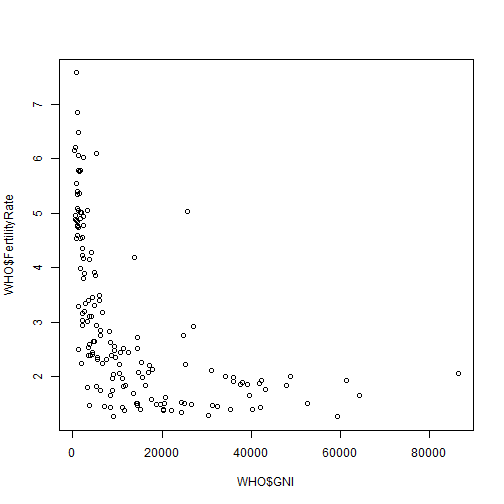 


This plot shows us that a higher fertility rate is correlated with a lower income. Now, let's redo this scatterplot, but this time using ggplot. We'll see how ggplot can be used to make more visually appealing and complex scatterplots. First, we need to install and load the ggplot2 package.


```r
install.packages("ggplot2")
```

```
## Installing package into 'C:/Users/Fahad/Documents/R/win-library/3.1'
## (as 'lib' is unspecified)
```

```
## Error: trying to use CRAN without setting a mirror
```

```r
library(ggplot2)
```


Now, remember we need at least three things to create a plot using ggplot-- data, an aesthetic mapping of variables in the data frame to visual output, and a geometric object.

So first, let's create the ggplot object with the data and the aesthetic mapping. We will save it to the variable scatterplot, In method aes(), we have to decide what we want on the x-axis and what we want on the y-axis:


```r
scatterplot = ggplot(WHO, aes(x = GNI, y = FertilityRate))
```

**Note** : if you type x=WHO$GNI, y=WHO$FertilityRate it will show WHO + $ on x and y axis.

Now, we need to tell ggplot what geometric objects to put in the plot. We could use bars, lines, points, or something else. This is a big difference between ggplot and regular plotting in R. You can build different types of graphs by using the same ggplot object. There's no need to learn one function for bar graphs, a completely different function for line graphs, etc.

So first, let's just create a straightforward scatterplot. So the geometry we want to add is points.
We can do this by typing the name of our ggplot object, scatterplot, and then adding the function, geom_point().


```r
scatterplot + geom_point()
```

```
## Warning: Removed 35 rows containing missing values (geom_point).
```

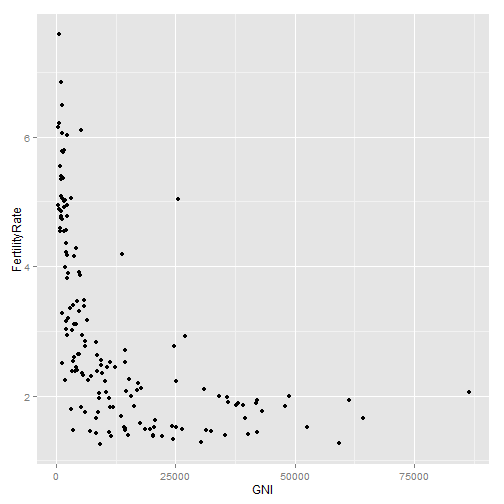 


You should see a very nice graphics as compared to the old plot() method as shown above. There are already a few nice improvements. One is that we don't have the data set name with a dollar sign in front of the label on each axis, just the variable name. Another is that we have these nice grid lines in the background and solid points that pop out from the background.
We could have made a line graph just as easily by changing point to line. So let's try that:


```r
scatterplot + geom_line()
```

```
## Warning: Removed 32 rows containing missing values (geom_path).
```

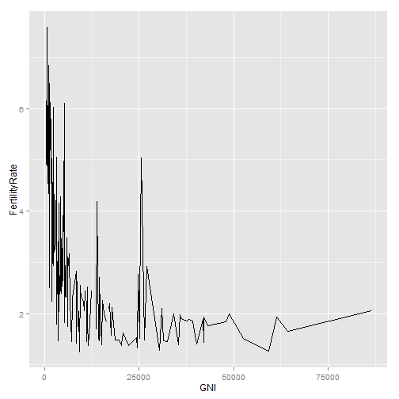 


Now, you can see a line graph in the Graphics window. However, a line doesn't really make sense for this particular plot, so let's switch back to our points:


```r
scatterplot + geom_point()
```

```
## Warning: Removed 35 rows containing missing values (geom_point).
```

 


In addition to specifying that the geometry we want is points, we can add other options, like the color, shape, and size of the points. Let's redo our plot with blue triangles instead of circles. To do that, go ahead and hit the up arrow in your R console, and then in the empty parentheses for geom_point, we're going to specify some properties of the points.
We want the color to be equal to "blue", the size to equal 3-- we'll make the points a little bigger -- and the shape equals 17.


```r
scatterplot + geom_point(color = "blue", size = 3, shape = 15)
```

```
## Warning: Removed 35 rows containing missing values (geom_point).
```

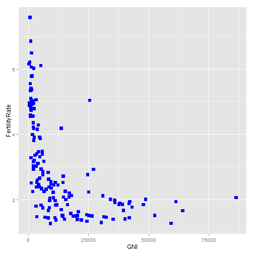 

Let's try another option. change "blue" to "darkred", and change shape to 8.


```r
scatterplot + geom_point(color = "darkred", size = 3, shape = 8)
```

```
## Warning: Removed 35 rows containing missing values (geom_point).
```

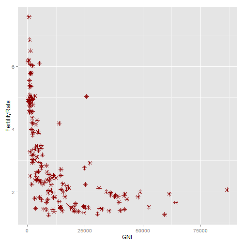 


Now, you should see dark red stars. There are many different colors and shapes that you can specify. Go up and read those options please.

Now, let's add a title to the plot.


```r

scatterplot + geom_point(color = "darkred", size = 3, shape = 8) + ggtitle("Fertility Rate vs. Gross National Income")
```

```
## Warning: Removed 35 rows containing missing values (geom_point).
```

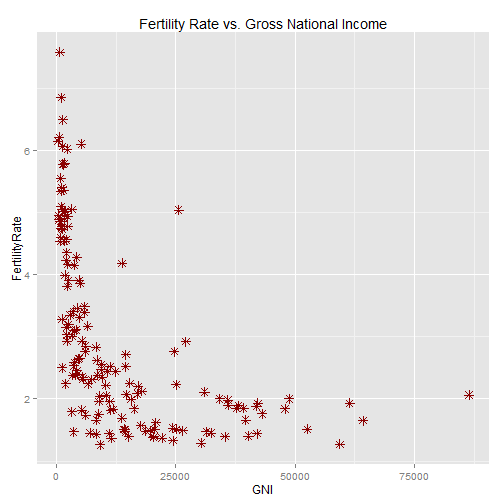 


Now, let's save our plot to a file. We can do this by first saving our plot to a variable.


```r

fertilityGNIplot = scatterplot + geom_point(color = "darkred", size = 3, shape = 8) + 
    ggtitle("Fertility Rate vs. Gross National Income")
```


This will save our scatterplot to the variable, fertilityGNIplot. Now, let's create a file we want to save our plot to. We can do that with the PDF function. And then in parentheses and quotes, type the name you want your file to have. We'll call it MyPlot.pdf.


```r
pdf("MyPlot.pdf")
```


Now, let's just print our plot to that file with the print function: 


```r
print(fertilityGNIplot)
```

```
## Warning: Removed 35 rows containing missing values (geom_point).
```

 

And lastly, we just have to type dev.off() to close the file.


```r
dev.off()
```

```
## pdf 
##   3
```


Now, if you look at the folder where WHO.csv is, you should see another file called MyPlot.pdf, containing the plot we made.

## More Scatterplots, Regression lines etc.

we'll see how to color our points by region and how to add a linear regression line to our plot. So we had the following plot:


```r

scatterplot + geom_point(color = "darkred", size = 3, shape = 8) + ggtitle("Fertility Rate vs. Gross National Income")
```

```
## Warning: Removed 35 rows containing missing values (geom_point).
```

 

Now, let's color the points by region instead. This time, we want to add a color option to our aesthetic, since we're assigning a variable in our data set to the colors.

To do this, we can type ggplot, and then first give the name of our data, like before, WHO, and then in our aesthetic, we again specify that x = GNI and y = FertilityRate. But then we want to add the option color = Region, which will color the points by the Region variable.


```r
ggplot(WHO, aes(x = GNI, y = FertilityRate, color = Region)) + geom_point()
```

```
## Warning: Removed 35 rows containing missing values (geom_point).
```

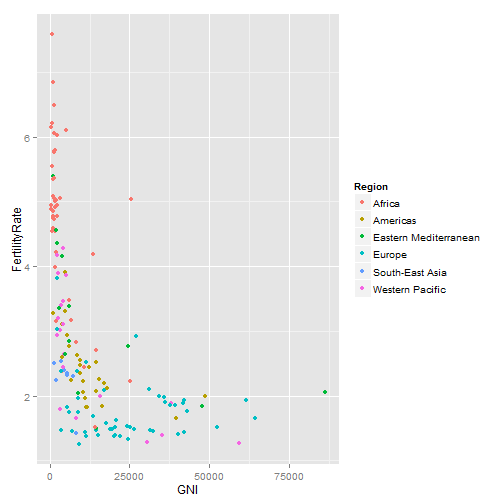 


Now, in our plot, we should see that each point is colored corresponding to the region that country belongs in. So the countries in Africa are colored red, the countries in the Americas are colored gold, the countries in the Eastern Mediterranean are colored green, etc. This really helps us see something that we didn't see before. The points from the different regions are really located in different areas on the plot.

Let's now instead color the points according to the country's life expectancy. Just replace Region by LifeExpectancy variable in the dataset.


```r
ggplot(WHO, aes(x = GNI, y = FertilityRate, color = LifeExpectancy)) + geom_point()
```

```
## Warning: Removed 35 rows containing missing values (geom_point).
```

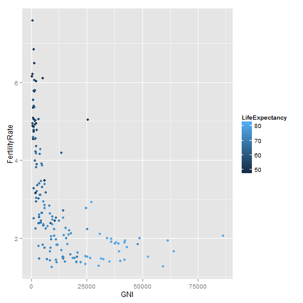 


Now, we should see that each point is colored according to the life expectancy in that country. Notice that before, we were coloring by a factor variable, Region. So we had exactly seven different colors corresponding to the seven different regions. Here, we're coloring by LifeExpectancy instead, which is a numerical variable, so we get a gradient of colors. Lighter blue corresponds to a higher life expectancy, and darker blue corresponds to a lower life expectancy.

Let's take a look at a different plot now.

Suppose we were interested in seeing whether the fertility rate of a country was a good predictor of the percentage of the population under 15. Intuitively, we would expect these variables to be highly correlated. But before trying any statistical models, let's explore our data with a plot.

So now, let's use the ggplot function on the WHO data again, but we're going to specify in our aesthetic that the x variable should be FertilityRate, and the y variable should be the variable, Under15. Again, we want to add geom_point, since we want a scatterplot.


```r
ggplot(WHO, aes(x = FertilityRate, y = Under15)) + geom_point()
```

```
## Warning: Removed 11 rows containing missing values (geom_point).
```

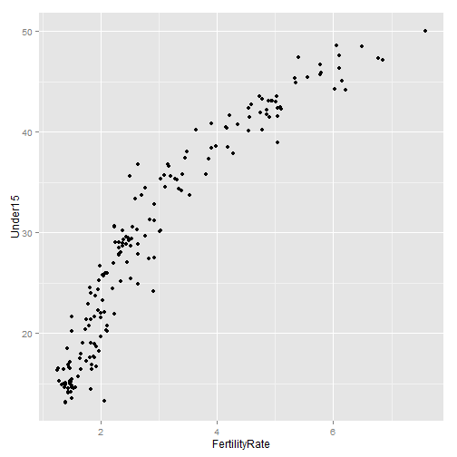 


This is really interesting. It looks like the variables are certainly correlated, but as the fertility rate increases, the variable, Under15 starts increasing less. So this doesn't really look like a linear relationship. But we suspect that a log transformation of FertilityRate will be better. Let's give it a shot.


```r
ggplot(WHO, aes(x = log(FertilityRate), y = Under15)) + geom_point()
```

```
## Warning: Removed 11 rows containing missing values (geom_point).
```

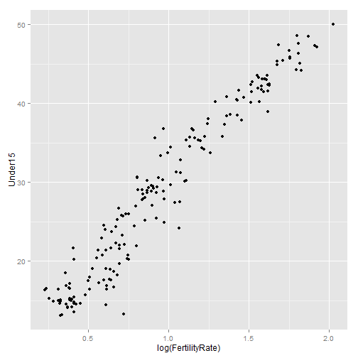 


Now this looks like a linear relationship. Let's try building in a simple linear regression model to predict the percentage of the population under 15, using the log of the fertility rate.


```r
model = lm(Under15 ~ log(FertilityRate), data = WHO)
summary(model)
```

```
## 
## Call:
## lm(formula = Under15 ~ log(FertilityRate), data = WHO)
## 
## Residuals:
##     Min      1Q  Median      3Q     Max 
## -10.313  -1.774   0.045   1.744   7.717 
## 
## Coefficients:
##                    Estimate Std. Error t value Pr(>|t|)    
## (Intercept)           7.654      0.448    17.1   <2e-16 ***
## log(FertilityRate)   22.055      0.418    52.8   <2e-16 ***
## ---
## Signif. codes:  0 '***' 0.001 '**' 0.01 '*' 0.05 '.' 0.1 ' ' 1
## 
## Residual standard error: 2.65 on 181 degrees of freedom
##   (11 observations deleted due to missingness)
## Multiple R-squared:  0.939,	Adjusted R-squared:  0.939 
## F-statistic: 2.79e+03 on 1 and 181 DF,  p-value: <2e-16
```

It looks like the log of FertilityRate is indeed a great predictor of Under15. The variable is highly significant, and our R-squared is 0.9391. Visualization was a great way for us to realize that the log transformation would be better.
If we instead had just used the FertilityRate, the R-squared would have been 0.87. That's a pretty significant decrease in R-squared.

So now, let's add this regression line to our plot. This is pretty easy in ggplot. We just have to add another layer.


```r
ggplot(WHO, aes(x = log(FertilityRate), y = Under15)) + geom_point() + stat_smooth(method = "lm")
```

```
## Warning: Removed 11 rows containing missing values (stat_smooth).
## Warning: Removed 11 rows containing missing values (geom_point).
```

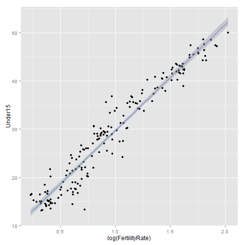 


Now, you should see a blue line going through the data. This is our regression line. By default, ggplot will draw a 95% confidence interval shaded around the line. We can change this by specifying options within the statistics layer.


```r
ggplot(WHO, aes(x = log(FertilityRate), y = Under15)) + geom_point() + stat_smooth(method = "lm", 
    level = 0.99)
```

```
## Warning: Removed 11 rows containing missing values (stat_smooth).
## Warning: Removed 11 rows containing missing values (geom_point).
```

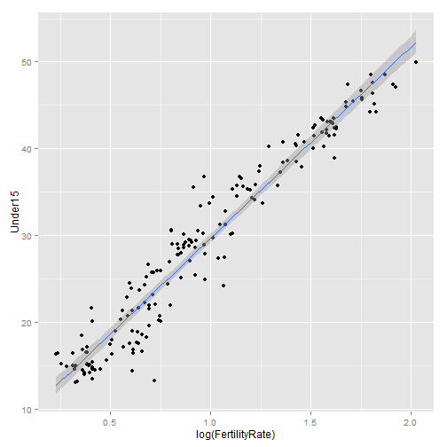 


This will give a 99% confidence interval. 
We could instead take away the confidence interval altogether by deleting level = 0.99 and typing se = FALSE.


```r
ggplot(WHO, aes(x = log(FertilityRate), y = Under15)) + geom_point() + stat_smooth(method = "lm", 
    se = FALSE)
```

```
## Warning: Removed 11 rows containing missing values (stat_smooth).
## Warning: Removed 11 rows containing missing values (geom_point).
```

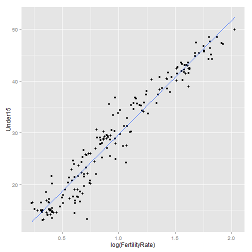 


Now, we just have the regression line in blue. We could also change the color of the regression line by typing as an option, color = "orange".


```r
ggplot(WHO, aes(x = log(FertilityRate), y = Under15)) + geom_point() + stat_smooth(method = "lm", 
    level = 0.99, color = "orange")
```

```
## Warning: Removed 11 rows containing missing values (stat_smooth).
## Warning: Removed 11 rows containing missing values (geom_point).
```

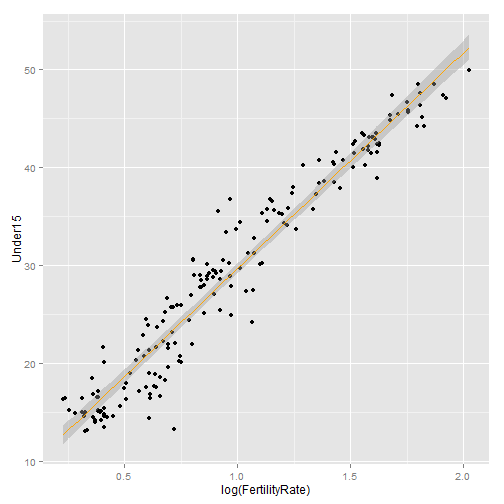 


As we've seen in this lecture, scatterplots are great for exploring data. However, there are many other ways to represent data visually, such as box plots, line charts, histograms, heat maps, and geographic maps. In some cases, it may be better to choose one of these other ways of visualizing your data. Luckily, ggplot makes it easy to go from one type of visualization to another, simply by adding the appropriate layer to the plot.

*So what is the edge of visualizations?* 
The WHO data that we used here is used by citizens, policymakers, and organizations around the world. Visualizing the data facilitates the understanding of global health trends at a glance. By using ggplot in R, we're able to visualize data for exploration, modeling, and sharing analytics results.  

Let's create the fertility rate versus population under 15 plot again:


```r
ggplot(WHO, aes(x = FertilityRate, y = Under15)) + geom_point()
```

```
## Warning: Removed 11 rows containing missing values (geom_point).
```

 


Now, color the points by the Region variable. You can add scale_color_brewer(palette="Dark2") to your plot if you are having a hard time distinguishing the colors (this color palette is often better if you are colorblind). To use this option, your plot command would be the following:


```r
ggplot(WHO, aes(x = FertilityRate, y = Under15, color = Region)) + geom_point(size = 5) + 
    scale_color_brewer(palette = "Dark2")
```

```
## Warning: Removed 11 rows containing missing values (geom_point).
```

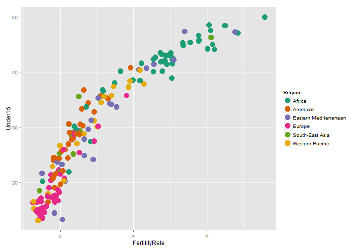 


To find out more about using ggplot in a colorblind-friendly way, please see: http://bconnelly.net/2013/10/creating-colorblind-friendly-figures/ 

**Q**: One region in particular has a lot of countries with a very low fertility rate and a very low percentage of the population under 15. Which region is it?

**ANS:** Europe
